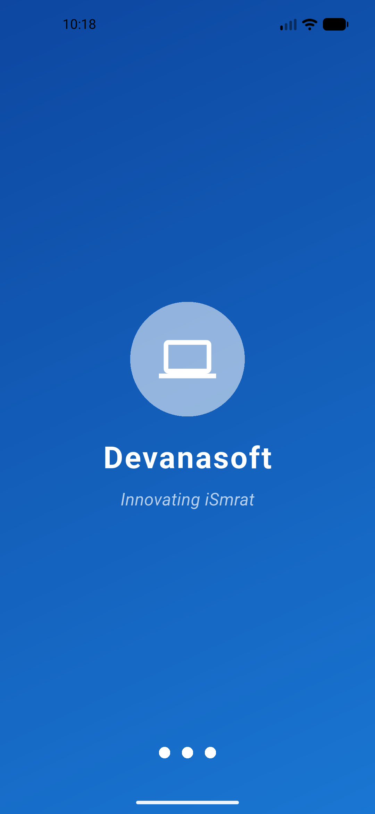
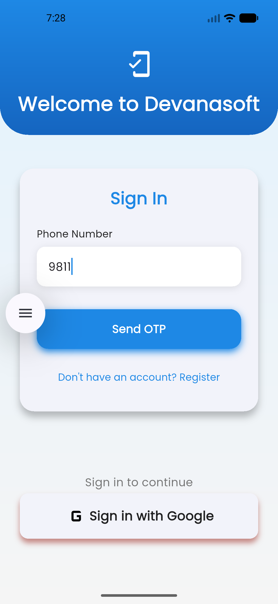
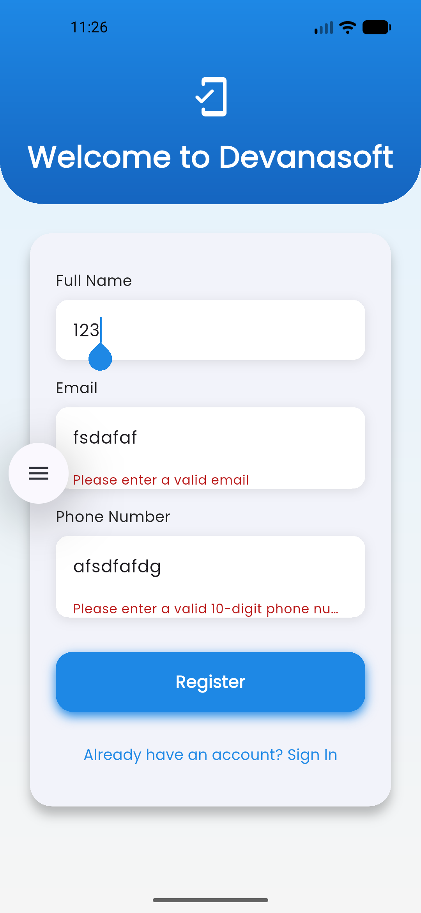
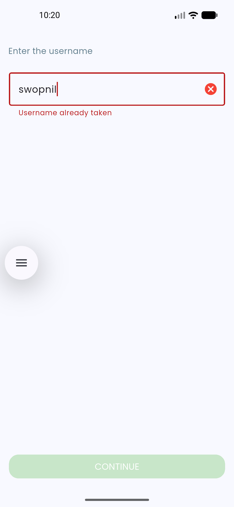
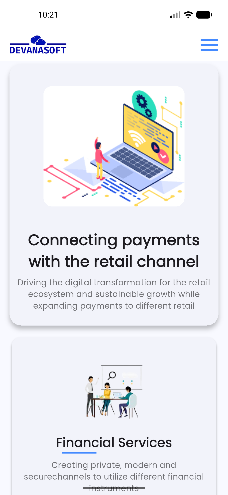
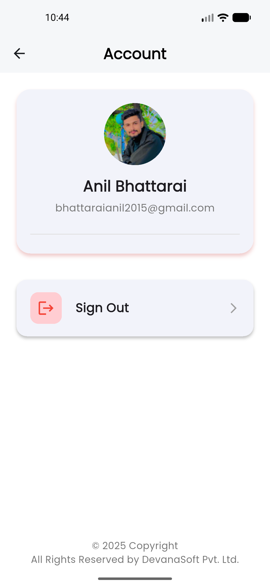
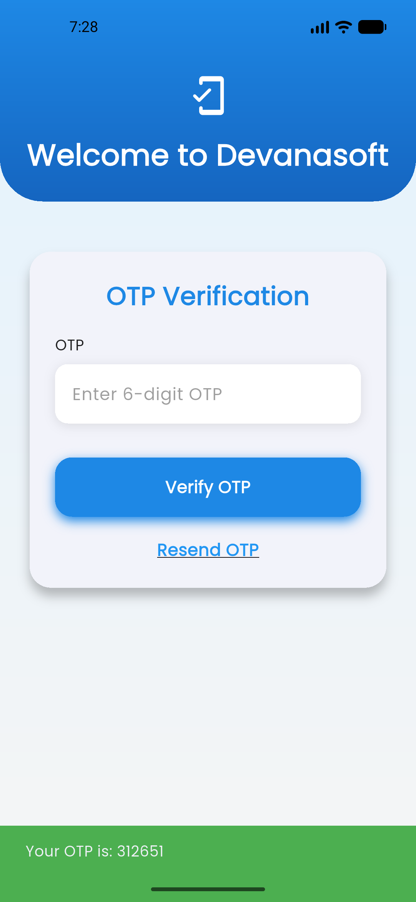
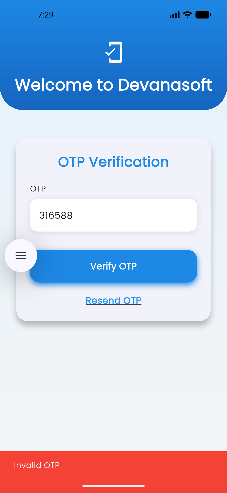
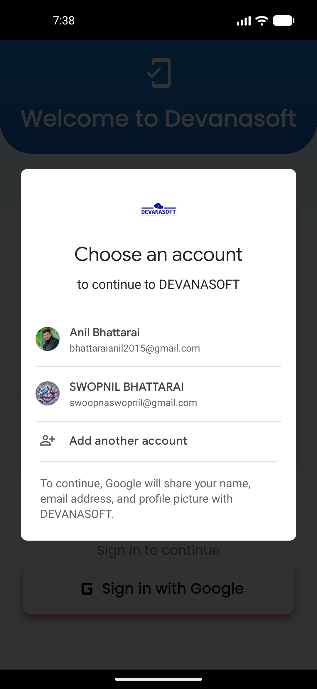

### DevanaSoft App

A modern and scalable **Flutter mobile application** inspired by **DevanaSoft**, built with clean architecture and best practices.  
This project demonstrates authentication, routing, UI components, and state management using **Flutter & Firebase**.

---

## 📱 App Preview

> Below are real screenshots from the mobile app demo showcasing major features and UI flows.

### 🔐 Authentication Flow
<p float="left">
  
  
  
</p>

### 🏠 Dashboard & Navigation
<p float="left">
  
  
  
</p>

### 📊 otp & Pages
<p float="left">
  
  
  
</p>

---

## ✨ Features

- 🔐 Firebase Authentication (Phone / OTP)
- 🧭 Clean Routing System
- 🧠 State Management (Riverpod / Provider)
- 🎨 Custom UI Components
- 📱 Responsive Mobile UI
- ⚡ Fast & Optimized Performance
- 🧩 Modular Folder Structure
- 🚪 Secure Logout Flow

---

## 🛠️ Tech Stack

| Technology | Usage |
|----------|------|
| **Flutter** | UI Framework |
| **Dart** | Programming Language |
| **Firebase** | Auth & Backend |
| **Riverpod / Provider** | State Management |
| **Material UI** | UI Components |

---

## 📂 Project Structure

```text
lib/
├── core/
│   ├── widgets/
│   ├── theme/
│   └── utils/
├── features/
│   ├── auth/
│   ├── dashboard/
│   └── profile/
├── routes/
├── services/
├── main.dart
---
```

### Getting Started

- Prerequisites
- Flutter SDK (latest stable)
- Android Studio / VS Code
- Firebase Project Setup

---

## Installation

- git clone https://github.com/Crealify/devanasoft_app.git
- cd devanasoft_app
- flutter pub get
- flutter run

---

## 📂 Project Structure

🌙 Dark Mode

🌍 Multi-language Support

🔔 Push Notifications

🧪 Unit & Widget Tests

📊 Analytics Integration

--- 

## 🤝 Contributing

Contributions are welcome!
Feel free to fork this repo and submit a pull request.

---

## 📄 License

This project is licensed under the MIT License.

---

## 👨‍💻 Author

Anil Bhattarai
Flutter Developer
Nepal


